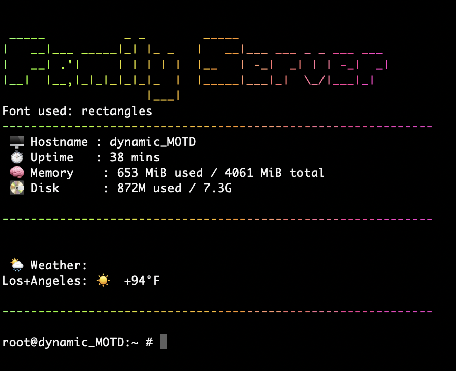

# 🐚 FreeBSD MOTD Customizer and dynamic_MOTD Installer  

[](https://www.freebsd.org/) 
[](#installation) 
[](LICENSE)  

This project is an **installer and setup helper** for the excellent [`dynamic_motd`](https://github.com/sstallion/dynamic_motd) project by [sstallion](https://github.com/sstallion).  
It automates installation, configures fonts, adds live weather, and ensures you get a rich and dynamic login experience out of the box.  

---
<div align="center">
  
</div>

--- 

<div align="center">
  
</div> 

---

## ✨ Features  

- Automated installer for [`dynamic_motd`](https://github.com/sstallion/dynamic_motd)  
- **Custom banner text** displayed in a rotating set of fun figlet fonts (customizable!)
- **Colorful output** with [`lolcat`](https://github.com/busyloop/lolcat)  
- **System stats at a glance**:  
  - 🖥️ Hostname  
  - ⏱️ Uptime  
  - 🧠 Memory usage  
  - 💽 Root filesystem disk usage  
- 🌦️ **Live weather** via [wttr.in](https://wttr.in)  
- 🔀 **Font rotation** – different figlet font at each login  
- 👎 **Failsafe behavior** – if a tool is missing, output gracefully falls back  

---

## ⚡ Quick Start  

You can install this tool in **two easy ways**:  

### Option 1️⃣: Fetch and Run Installer Script Directly  

```sh
# fetch -o - https://raw.githubusercontent.com/kevinlearnscoding/FreeBSD_dynamic_MOTD_installer/refs/heads/main/setupMOTDv2.sh | sh
```

---

### Option 2️⃣: Download, Inspect, and Run  

```sh
# fetch -o installer.sh https://raw.githubusercontent.com/kevinlearnscoding/FreeBSD_dynamic_MOTD_installer/refs/heads/main/setupMOTDv2.sh
# chmod +x installer.sh
# ./installer.sh
```

---

## ⚠️ Requirements & Notes  

- Requires **FreeBSD 13.0+**  
- Installer will automatically install:  
  - [`dynamic_motd`](https://github.com/sstallion/dynamic_motd)  
  - [`figlet`](https://github.com/freebsd/freebsd-ports/tree/main/misc/figlet) + [`figlet-fonts`](https://github.com/freebsd/freebsd-ports/tree/20237f32ca631de448160f3eeeff6f328a4866be/misc/figlet-fonts) [(www.figlet.org)](http://www.figlet.org)
  - [`curl`](https://github.com/curl/curl)  
  - [`lolcat`](https://github.com/busyloop/lolcat)  
- Unicode support:  
  - Use a UTF-8 locale (e.g., en_US.UTF-8)  
  - Use a font with extended glyph support (recommended: [**Nerd Fonts**](https://github.com/ryanoasis/nerd-fonts))  

⚠️ **Note on Icons and Emojis**  
Not all terminals render fancy characters equally. If icons like `🧠` or `🌦️` don’t appear correctly, try switching fonts or terminals.  

---

## 🛠️ What the Installer Does  

1. **Prompts you for setup details**:  
   - Banner text  
   - City or airport code (for weather)  
   - Temperature units (°F or °C)  

2. **Installs dependencies** and configures system services:  
   - Disables update_motd  
   - Enables dynamic_motd  
   - Backs up /etc/motd.template  

3. **Deploys a new MOTD generator script** at /usr/local/etc/rc.motd which:  
   - Displays your custom banner in a rotating font  
   - Adds system stats with decorative dividers  
   - Fetches and shows weather info  

4. **Starts the service immediately**, so you see results on your next shell login.  

---

## 🖼️ Example Output (without color because github filters it out!👎)

```text
 __  __          _____                          
|  \/  |        / ____|                         
| \  / |_   _  | (___   ___ _ ____   _____ _ __ 
| |\/| | | | |  \___ \ / _ \ '__\ \ / / _ \ '__|
| |  | | |_| |  ____) |  __/ |   \ V /  __/ |   
|_|  |_|\__, | |_____/ \___|_|    \_/ \___|_|   
         __/ |                                  
        |___/                                   
                                                              
Font used: big
------------------------------------------------------------
 🖥️  Hostname : freebsd-testbox
 ⏱️  Uptime   : 3 days
 🧠 Memory    : 2048 MiB used / 8192 MiB total
 💽 Disk      : 12G used / 32G

------------------------------------------------------------
 🌦️  Weather:
 San Francisco: 🌤️ +22°C
------------------------------------------------------------
```

---

## 📂 Configuration  

After installation, you can edit the MOTD script directly:  

```
/usr/local/etc/rc.motd
```

- Add or remove fonts from the rotation  
- Change the banner text  
- Adjust the weather query URL  
- Insert your own custom system checks or ASCII art  

Changes take effect **immediately** on the next login.  

---

## 🙌 Contributing  

- Contributions to this installer are welcome!  
- If you want to improve dynamic_motd itself, head over to the upstream repo: [sstallion/dynamic_motd](https://github.com/sstallion/dynamic_motd).  

---

## 📜 License  

This project is an **installer and customizer only** and is distributed under the **BSD 2-Clause License**, in line with the upstream [`dynamic_motd`](https://github.com/sstallion/dynamic_motd).  
See [LICENSE](LICENSE) for details.  

All credit for the underlying MOTD functionality belongs to [sstallion](https://github.com/sstallion) and contributors to [`dynamic_motd`](https://github.com/sstallion/dynamic_motd).  
